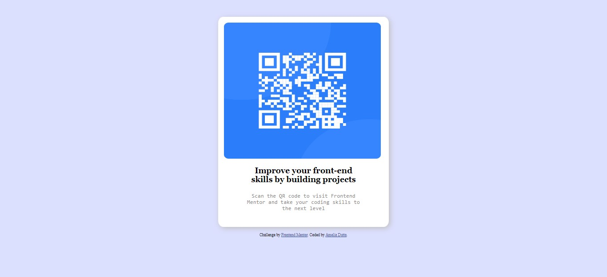

# Frontend Mentor - QR code component solution

This is a solution to the [QR code component challenge on Frontend Mentor](https://www.frontendmentor.io/challenges/qr-code-component-iux_sIO_H). Frontend Mentor challenges help you improve your coding skills by building realistic projects. 

## Table of contents

- [Overview](#overview)
  - [Screenshot](#screenshot)
  - [Links](#links)
- [My process](#my-process)
  - [Built with](#built-with)
  - [What I learned](#what-i-learned)
  - [Continued development](#continued-development)
  - [Useful resources](#useful-resources)
- [Author](#author)
- [Acknowledgments](#acknowledgments)

## Overview

### Screenshot

### Links

- Solution URL: [GitHub](https://github.com/amelia2802/qr-code-component/)
- Live Site URL: [Live](https://amelia2802.github.io/qr-code-component/)

## My process

### Built with

- Semantic HTML5 markup
- CSS custom properties

## Author

- Website - [Amelia Dutta](https://www.linkedin.com/in/ameliadutta/)
- Frontend Mentor - [@amelia2802](https://www.frontendmentor.io/profile/amelia2802)
- Twitter - [@AmeliaDutta](https://www.twitter.com/AmeliaDutta)
